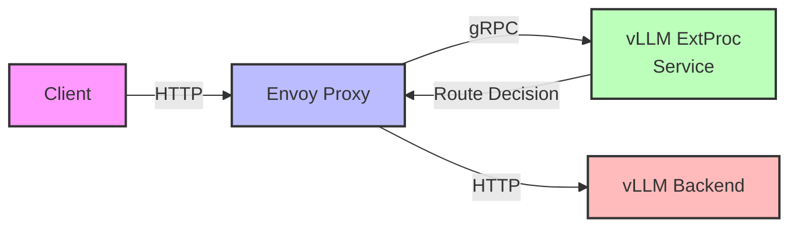

# vLLM Router with Envoy ExtProc

This document explains the architecture and setup of the vLLM Router integrated with Envoy's External Processing (ExtProc) filter. The system provides a flexible and scalable way to route LLM requests to appropriate backends while allowing request/response processing through Envoy's ExtProc feature.

## Architecture Overview

The system consists of three main components:

1. **Envoy Proxy**: Front-facing proxy that handles incoming HTTP requests and routes them through the ExtProc filter
2. **vLLM ExtProc Service**: gRPC service that processes requests and determines routing based on configured routes
3. **vLLM Backend**: The actual LLM service that handles the model inference requests



### Component Details

1. **Envoy Proxy**:
   - Handles all incoming HTTP traffic
   - Routes requests through the ExtProc filter for processing
   - Configured with specific routes for different model endpoints
   - Manages timeouts and connection settings

2. **vLLM ExtProc Service**:
   - Implements the Envoy ExtProc gRPC service
   - Processes requests based on route configurations
   - Supports model selection and request validation
   - Provides dynamic routing based on load balancing strategy

3. **vLLM Backend**:
   - Handles actual model inference requests
   - Supports multiple model endpoints
   - Scales independently based on load

## Running the Services

### Prerequisites

- Python 3.8+
- Envoy Proxy v1.27 or later
- gRPC tools and runtime

### 1. Start the vLLM ExtProc Service

```bash
python src/vllm_router/extproc.py \
  --service-discovery=static \
  --static-hosts=localhost:8000 \
  --routing-logic=least_outstanding_requests \
  --route-config=config/routes.json \
  --log-level=info \
  --port=50051
```

Configuration options:
- `--service-discovery`: Method for discovering backend services (`static` or `k8s`)
- `--static-hosts`: List of backend hosts (for static discovery)
- `--routing-logic`: Load balancing strategy
- `--route-config`: Path to route configuration JSON file
- `--log-level`: Logging verbosity
- `--port`: gRPC service port

### 2. Start Envoy Proxy

```bash
envoy -c envoy.yaml --service-cluster envoy-proxy --service-node envoy-proxy
```

The Envoy configuration (`envoy.yaml`) includes:
- Listener configuration on port 8080
- ExtProc filter configuration
- Route configurations for different endpoints
- Backend cluster configurations

### 3. Start vLLM Backend (if running locally)

```bash
python -m vllm.entrypoints.api_server \
  --model gpt-3.5-turbo \
  --port 8000
```

## Route Configuration

The route configuration (`routes.json`) defines the mapping between endpoints and models:

```json
[
  {
    "name": "chat-route",
    "model": "gpt-3.5-turbo",
    "path_prefix": "/v1/chat"
  },
  {
    "name": "completion-route",
    "model": "text-davinci-003",
    "path_prefix": "/v1/completions"
  }
]
```

## Testing the Setup

1. Test the chat completion endpoint:
```bash
curl -X POST http://localhost:8080/v1/chat/completions \
  -H "Content-Type: application/json" \
  -d '{
    "model": "gpt-3.5-turbo",
    "messages": [{"role": "user", "content": "Hello!"}]
  }'
```

2. Test the text completion endpoint:
```bash
curl -X POST http://localhost:8080/v1/completions \
  -H "Content-Type: application/json" \
  -d '{
    "model": "text-davinci-003",
    "prompt": "Hello, world!"
  }'
```

## Monitoring

- Envoy admin interface: http://localhost:9901
- ExtProc metrics: Available through the gRPC service
- Backend metrics: Available through the vLLM API server

## Kubernetes Deployment

For Kubernetes deployment, use the provided YAML files:
- `envoy-proxy.yaml`: Deploys the Envoy proxy
- `vllm-extproc.yaml`: Deploys the ExtProc service and related configurations

Apply the configurations:
```bash
kubectl apply -f vllm-extproc.yaml
kubectl apply -f envoy-proxy.yaml
```

## Troubleshooting

1. Check Envoy logs for routing issues:
```bash
kubectl logs -f deployment/envoy-proxy
```

2. Check ExtProc service logs:
```bash
kubectl logs -f deployment/vllm-extproc
```

3. Common issues:
   - ExtProc service not reachable: Check network connectivity and service discovery
   - Route configuration not working: Verify route names match in both Envoy and ExtProc configs
   - Backend not responding: Check backend health and connectivity

## Security Considerations

1. Network Security:
   - Use TLS for all external connections
   - Implement proper authentication and authorization
   - Consider network policies in Kubernetes

2. Resource Management:
   - Set appropriate resource limits
   - Configure timeouts for all components
   - Implement rate limiting if needed 